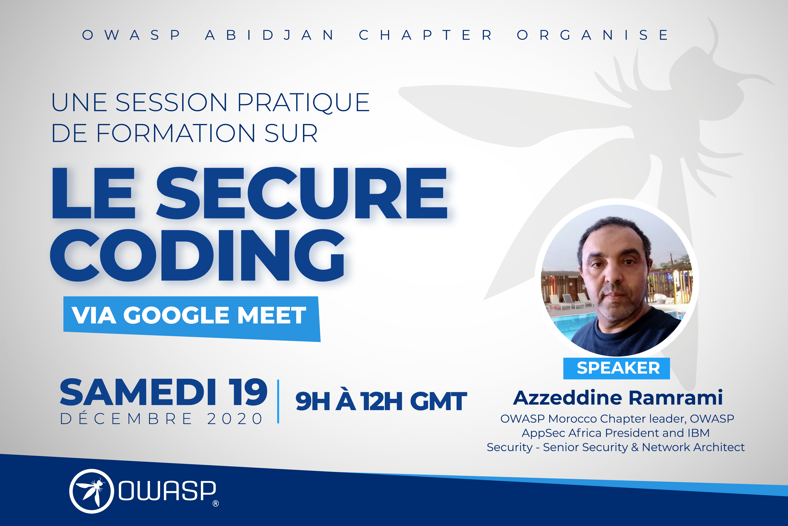

## Upcoming Event - December 19 2020 - Secure Coding with OWASP

It's important for developers and cybersecurity expert to be aware of best practices during application coding to avoid security holes. This hands-on will be handle by Azzeddine Ramrami.

### Program

     1. Introduction to Secure coding 
     2. Threat Modeling
     3. Secure coding Principles
     4. OWASP top 10 2017
     5. SANS top 25 2019
     
### Subscription (Free)

[Registration] (https://www.eventbrite.co.uk/e/secure-coding-with-owasp-tickets-132958192533)

